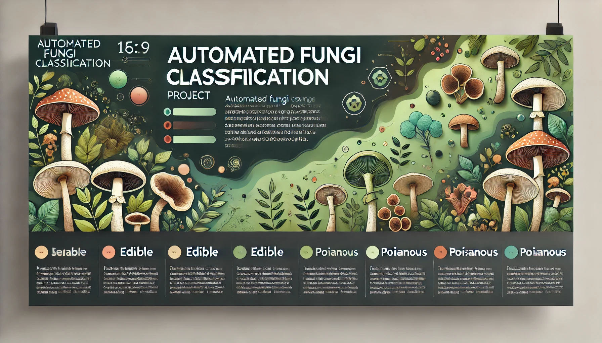

  

# Automated Fungi Classification Project

## Technologies Used 

 

## Overview

The **Brisbane Flora and Fauna Society (BFFS)** has initiated a project to classify fungi species into **edible** or **poisonous** categories. This initiative aims to create a mobile application that helps the public make informed decisions about fungi they encounter in Brisbane parklands, backyards, and surrounding areas. 

### Key Objectives:
1. **Educate the public** on fungi species.
2. **Promote safety** by identifying poisonous fungi.
3. Support ecological balance by fostering the growth of non-dangerous fungi.

---

## Project Approach

### Dataset
- **10 Fungi Species**: 5 edible, 5 poisonous.
- **Training Images**: 1001 labeled images across species.
- **Held-out Test Set**: 500 images used for final evaluation.

### Constraints
1. Limited computational power (CPU-only device with 6 GB RAM).
2. Fast runtime (model initialization < 1 minute; prediction < 200 ms/image).

### Deliverables
1. Recommended ML algorithm.
2. Justification and explanation of the proposed solution.

---

## Best Solution

### Model Description
The solution employs a **two-stage architecture** combining a pre-trained vision transformer (DINO) for feature extraction and a custom classifier. 

#### Components:
1. **Feature Extractor**:
   - Model: DINO (Vision Transformer, `dinov2_vits14`).
   - Pre-trained on large datasets for robust feature extraction.

2. **Classifier**:
   - Architecture:
     - Input: 384-dimensional features.
     - Hidden Layer: 128 neurons with ReLU activation.
     - Output Layer: 10 classes (fungi species).
   - Training: Fine-tuned on the fungi dataset.

#### Key Features:
- **Efficiency**: Operates under the provided constraints.
- **Accuracy**: High performance on validation data due to robust feature extraction and a lightweight classifier.

---

### Implementation Details

#### Setup Method
- Loads the DINO model and custom classifier.
- Applies standard image preprocessing (resize, normalization).

#### Test Method
- Transforms input images.
- Extracts features using DINO.
- Predicts the species class using the custom classifier.

#### Key File: `pretrained_model.py`
- Contains the model architecture, training pipeline, and prediction logic.

---

## Results
The best solution utilized the **pretrained DINO model** for feature extraction and a lightweight classifier for species identification. The approach met all constraints and achieved optimal performance, as evaluated on the provided validation dataset.

---
